# ForeignLove
#### 교환학생들을 위한 커뮤니티 서비스입니다.

'Foreign Love'는 한국학생 중 외국 교환 프로그램에 참여하는 학생들을 위한 커뮤니티 입니다.

---

## 개발 팀 정보
- 팀명 : Fall in Love
- 팀장 : 송무송([@moosongsong](https://github.com/moosongsong))
- 부팀장 : 김우석([@WOOSERK](https://github.com/WOOSERK))
- 팀원 : 문효원([@moon-hw](https://github.com/moon-hw)), 박원창([wonchangPark](https://github.com/wonchangPark))

---

### 목차

프로젝트 개요

[프로젝트 개요](#1) 
    [1. 서비스 설명](#1.1) 
    [2. 사용 기술](#1.2) 
    [3. 팀 업무 분담](#1.3)
    [4. 프로젝트 수행 일정](#1.4)

서비스 설계

[서비스 설계 및 소개](#2) 
    [1. DB 설계](#2.1) 
    [2. 회원관리](#2.2) 
    [3. 1:1쪽지](#2.3) 
    [4. 자유게시판](#2.4) 
    [5. 장터게시판](#2.5) 
    [6. 홍보게시판](#2.6) 
    [7. 댓글&좋아요](#2.7) 

---

## 프로젝트 개요

### 1. 서비스 설명

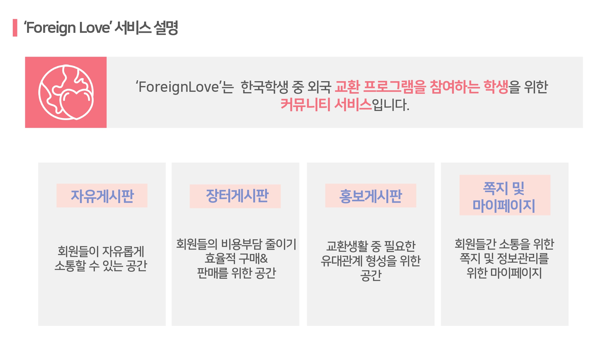

### 2. 사용 기술

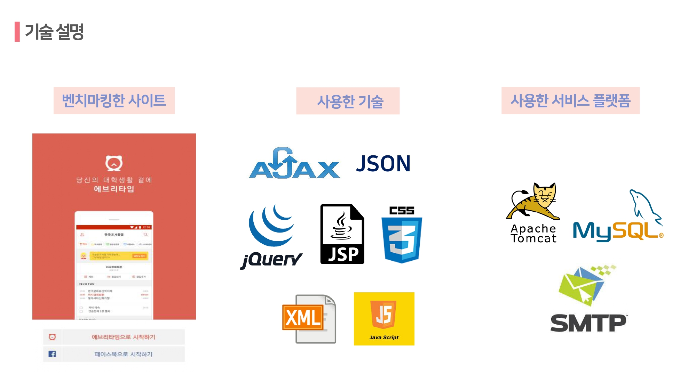

### 3. 팀 업무 분담 

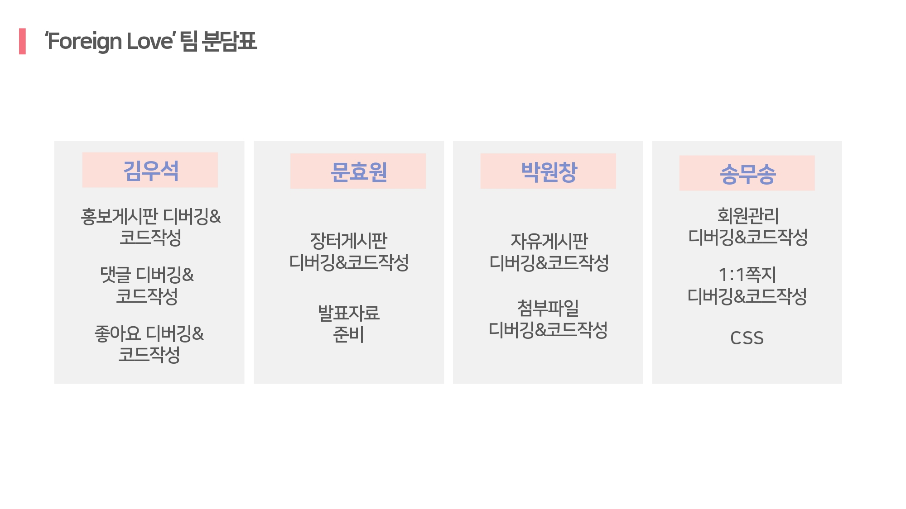

### 4. 프로젝트 수행 일정

---

## 서비스 설계 및 소개

### 1. DB 설계
#### ER-Diagram

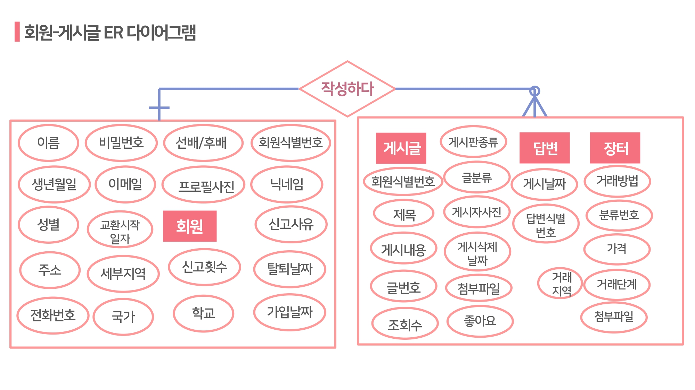

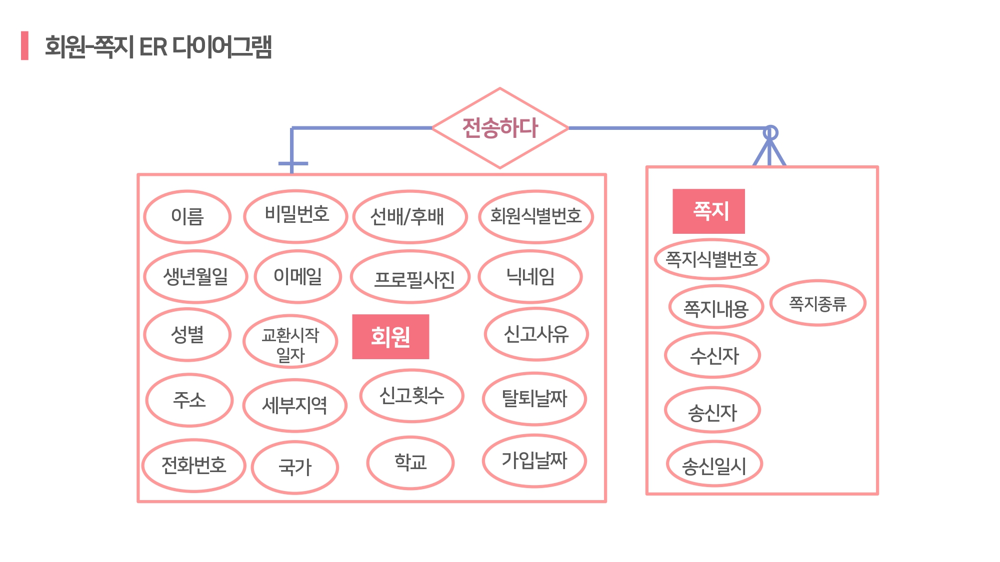

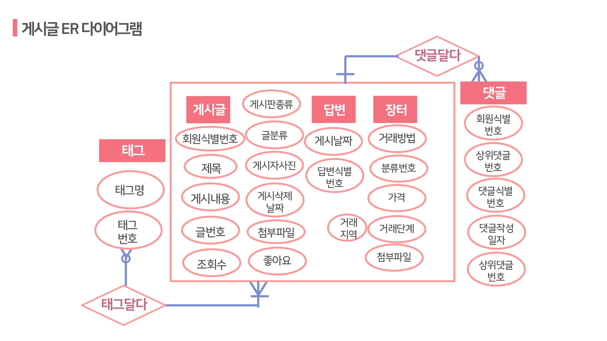

#### 논리스키마

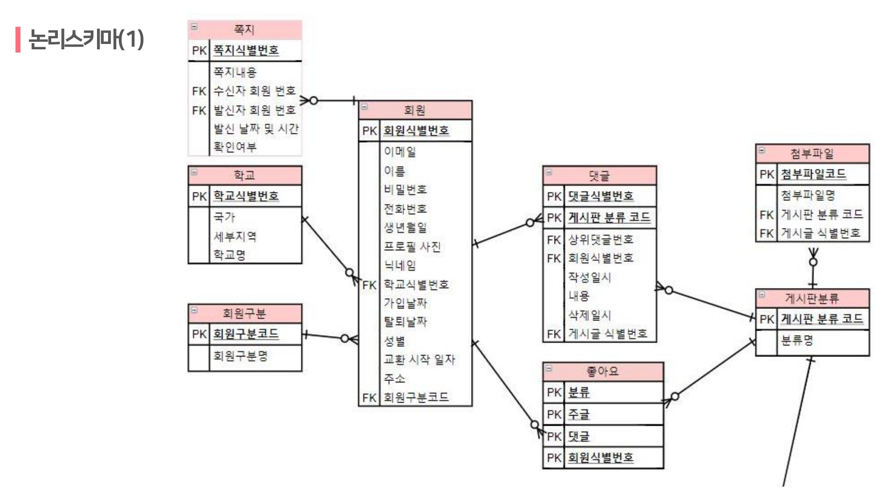

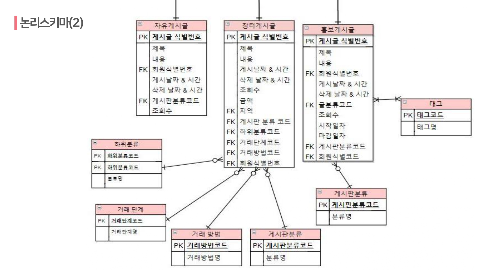

### 2. 회원관리
#### 📍회원가입
이메일/비밀번호/비밀번호확인/본명/전화번호/생년월일/별명/학교/교환시작일자/주소 기입 
🔎이메일 중복확인, 닉네임 중복확인, 개인정보 활용 동의 후 최종 회원가입 가능
#### 📍회원로그인
이메일과 비밀번호를 통해 로그인 진행 
🔎비밀번호 분실 시 가입 시 등록했던 이메일 인증을 통해 비밀번호 찾기
#### 📍마이페이지
로그인 시 메인 페이지. 좌측에는 마이페이지 관련 프로필로 고정 
🔎본명/학교/성별/정보수정/글쓰기/쪽지함/검색 메뉴 고정
#### 📍회원정보 수정
비밀번호 인증후 개인정보 수정 가능 
🔎이메일, 본명, 생년월일, 닉네임 수정 불가
#### 📍회원 탈퇴
정보 수정 페이지 하단에서 회원탈퇴 가능 
🔎비밀번호 입력을 통한 본인 확인후 회원탈퇴 가능

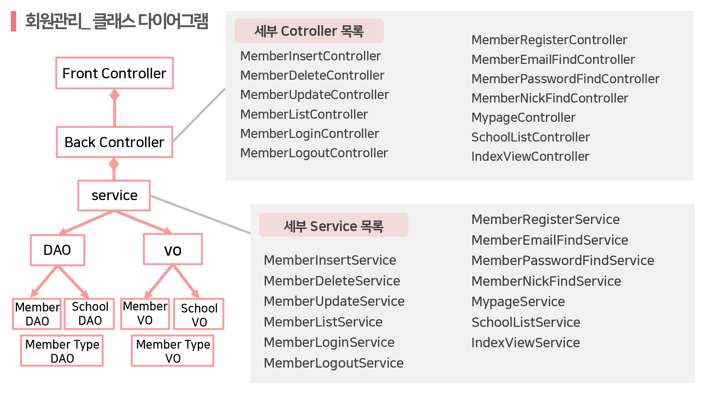

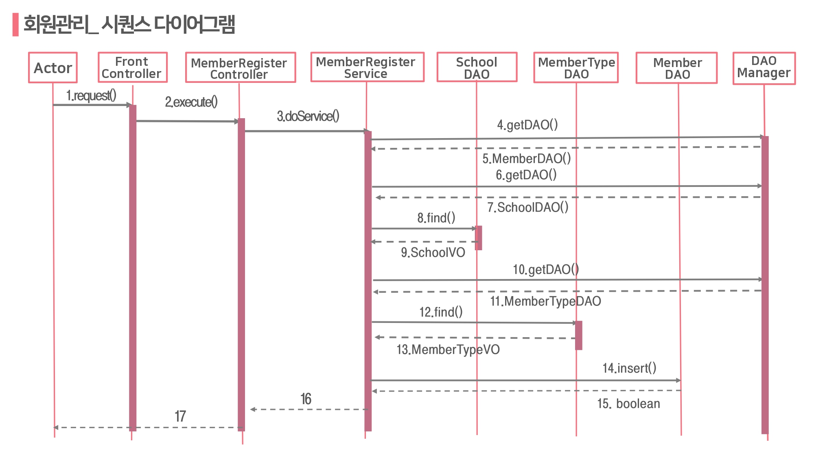

### 3. 1:1 쪽지
#### 📍쪽지 전송
받은 사람의 이메일 주소와 내용 입력후 쪽지 전송 가능 
🔎전송 버튼을 누르면 수신자의 닉네임이 뜨며 전송. 받은 쪽지에 대한 답장 가능.
#### 📍쪽지 확인
받은 쪽지함/보낸쪽지함/학생보기 중 하나의 카테고리 선택 후 확인 
🔎쪽지번호/보낸사람/내용/일시/읽음 확인 순으로 내용 출력
#### 📍쪽지함 관리
학생보기는 본인을 제외한 같은 학교 학생의 리스트 제공 
🔎학년으로 내림차순.

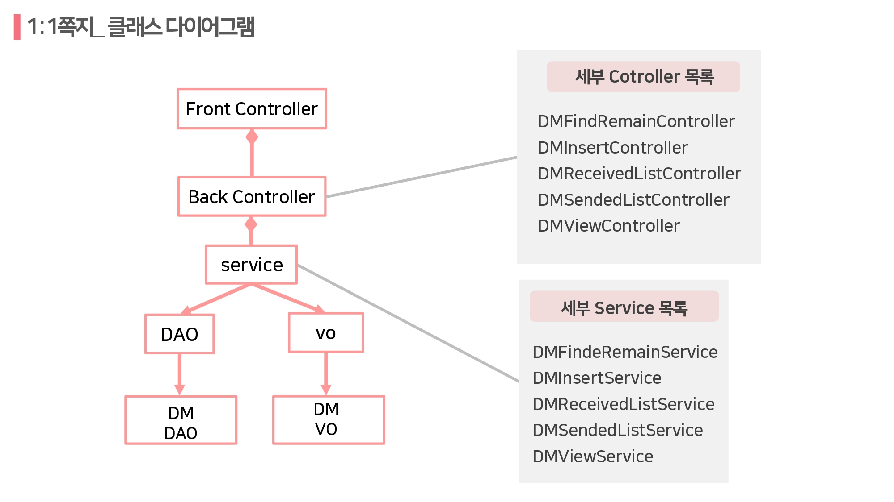

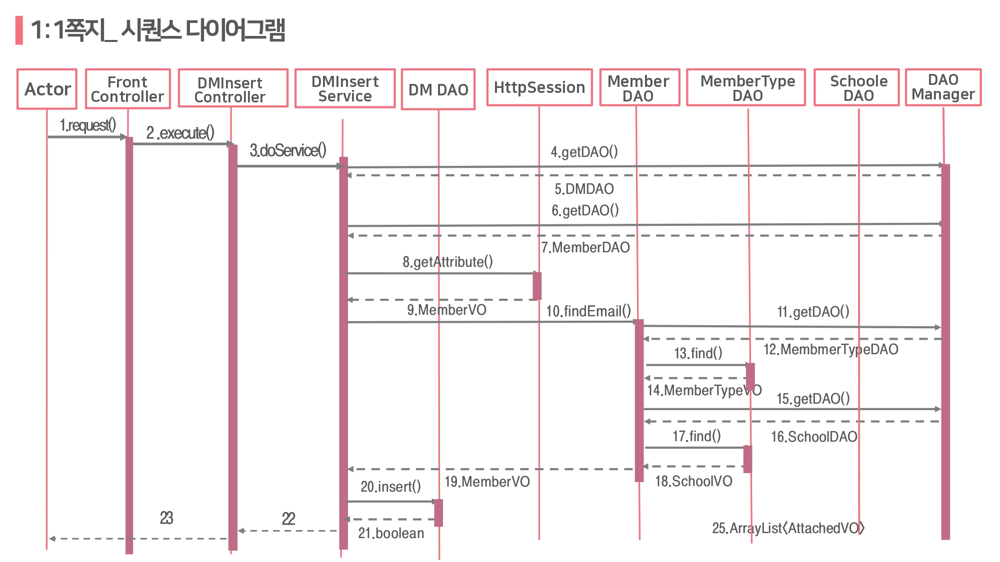

