# ForeignLove
#### 교환학생들을 위한 커뮤니티 서비스입니다.

'Foreign Love'는 한국학생 중 외국 교환 프로그램에 참여하는 학생들을 위한 커뮤니티 입니다.

---

## 개발 팀 정보
- 팀명 : Fall in Love
- 팀장 : 송무송([@moosongsong](https://github.com/moosongsong))
- 부팀장 : 김우석([@WOOSERK](https://github.com/WOOSERK))
- 팀원 : 문효원([@moon-hw](https://github.com/moon-hw)), 박원창([wonchangPark](https://github.com/wonchangPark))

---

### 목차

프로젝트 개요

[프로젝트 개요](#1) 
    [1. 서비스 설명](#1.1) 
    [2. 사용 기술](#1.2) 
    [3. 팀 업무 분담](#1.3) 
    [4. 프로젝트 수행 일정](#1.4)

서비스 설계

[서비스 설계 및 소개](#2) 
    [1. DB 설계](#2.1) 
    [2. 회원관리](#2.2) 
    [3. 1:1쪽지](#2.3) 
    [4. 자유게시판](#2.4) 
    [5. 장터게시판](#2.5) 
    [6. 홍보게시판](#2.6) 
    [7. 댓글&좋아요](#2.7) 

---

## 프로젝트 개요

### 1. 서비스 설명

### 2. 사용 기술

### 3. 팀 업무 분담 

### 4. 프로젝트 수행 일정

---

## 서비스 설계 및 소개

### 1. DB 설계
#### ER-Diagram

#### 논리스키마

### 2. 회원관리
#### 📍회원가입
이메일/비밀번호/비밀번호확인/본명/전화번호/생년월일/별명/학교/교환시작일자/주소 기입 
🔎이메일 중복확인, 닉네임 중복확인, 개인정보 활용 동의 후 최종 회원가입 가능
#### 📍회원로그인
이메일과 비밀번호를 통해 로그인 진행 
🔎비밀번호 분실 시 가입 시 등록했던 이메일 인증을 통해 비밀번호 찾기
#### 📍마이페이지
로그인 시 메인 페이지. 좌측에는 마이페이지 관련 프로필로 고정 
🔎본명/학교/성별/정보수정/글쓰기/쪽지함/검색 메뉴 고정
#### 📍회원정보 수정
비밀번호 인증후 개인정보 수정 가능 
🔎이메일, 본명, 생년월일, 닉네임 수정 불가
#### 📍회원 탈퇴
정보 수정 페이지 하단에서 회원탈퇴 가능 
🔎비밀번호 입력을 통한 본인 확인후 회원탈퇴 가능

### 3. 1:1 쪽지
#### 📍쪽지 전송
받은 사람의 이메일 주소와 내용 입력후 쪽지 전송 가능 
🔎전송 버튼을 누르면 수신자의 닉네임이 뜨며 전송. 받은 쪽지에 대한 답장 가능.
#### 📍쪽지 확인
받은 쪽지함/보낸쪽지함/학생보기 중 하나의 카테고리 선택 후 확인 
🔎쪽지번호/보낸사람/내용/일시/읽음 확인 순으로 내용 출력
#### 📍쪽지함 관리
학생보기는 본인을 제외한 같은 학교 학생의 리스트 제공 
🔎학년으로 내림차순.

### 4. 자유게시판
#### 📍자유 게시판 글 작성
제목/내용/파일첨부를 작성한 뒤 '글 등록' 버튼을 통해 등록
#### 📍자유 게시판 글 수정
본인에 한하여 글 제목, 내용 수정 가능
#### 📍자유 게시판 글 삭제
본인/관리자에 한하여 글 삭제 가능
#### 📍자유 게시판 목록보기
글제목/작성자/작성일자/좋아요/조회수 순으로 확인가능
#### 📍자유 게시판 글 보기
조회수/좋아요/제목/내용/작성자닉네임/학교/작성일자 순으로 표시됨.
#### 📍자유 게시판 글 검색
제목/내용 중 하나 선택 후 검색

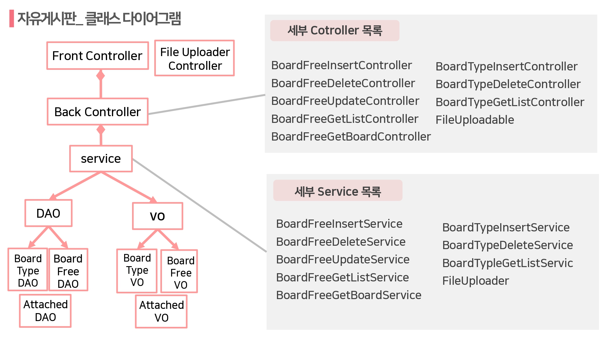

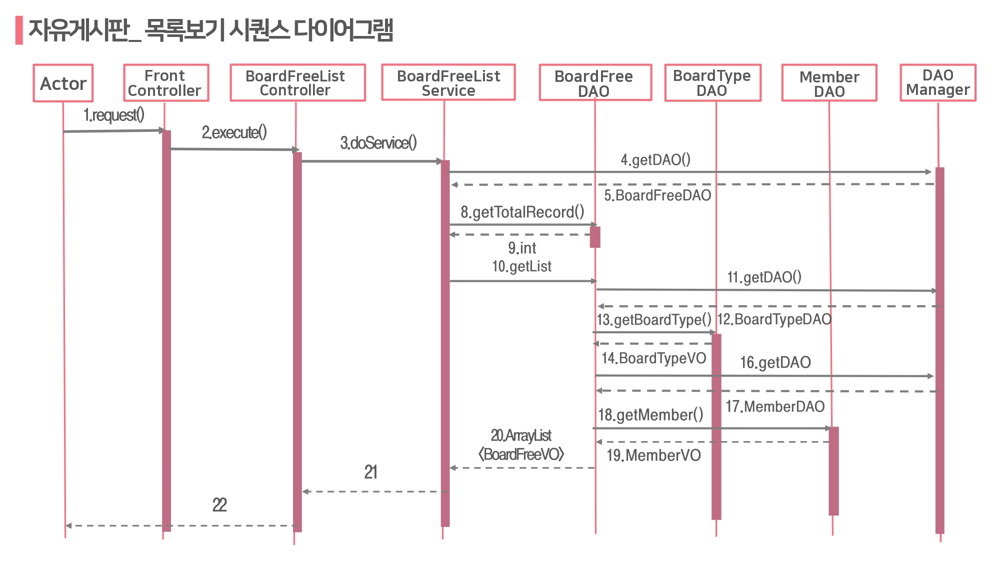

### 4. 장터게시판
#### 📍장터 게시판 글 작성
제목/글분류/소분류/거래방법/첨부파일/판매가격/내용을 작성한 뒤 '글 등록' 버튼을 통해 등록
#### 📍장터 게시판 글 수정
본인에 한하여 글 제목, 글분류, 소분류, 거래방법, 판매가격, 내용 수정 가능
#### 📍장터 게시판 글 삭제
본인/관리자에 한하여 글 삭제 가능
#### 📍자유 게시판 목록보기
판매해요/구매해요 중 하나의 카테고리 선택 후 리스트로 확인 가능 
🔎글제목/작성자/작성일자/좋아요/조회수 순으로 확인가능
#### 📍자유 게시판 글 보기
조회수/좋아요/제목/판매가격/내용/작성자정보(닉네임,이메일,주소,학교)/작성일자 순으로 표시됨.
#### 📍자유 게시판 글 검색
전체/제목/내용 중 하나 선택 후 검색

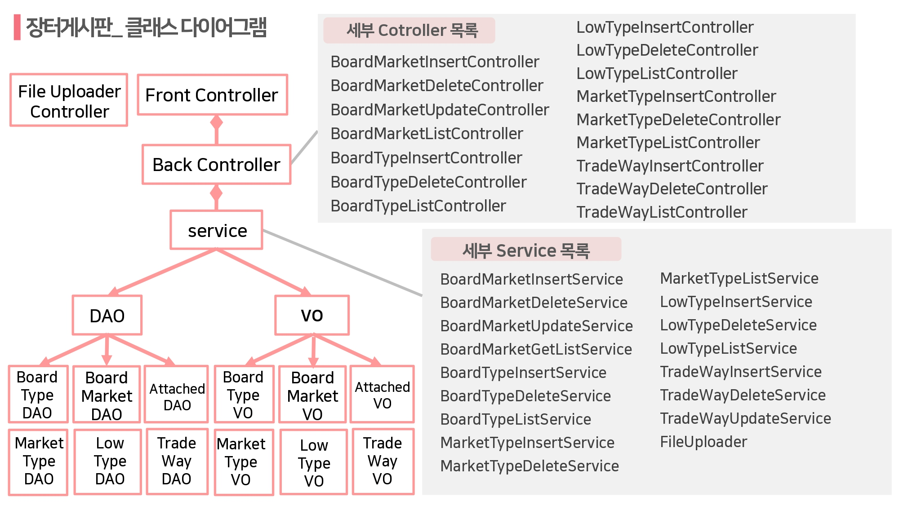

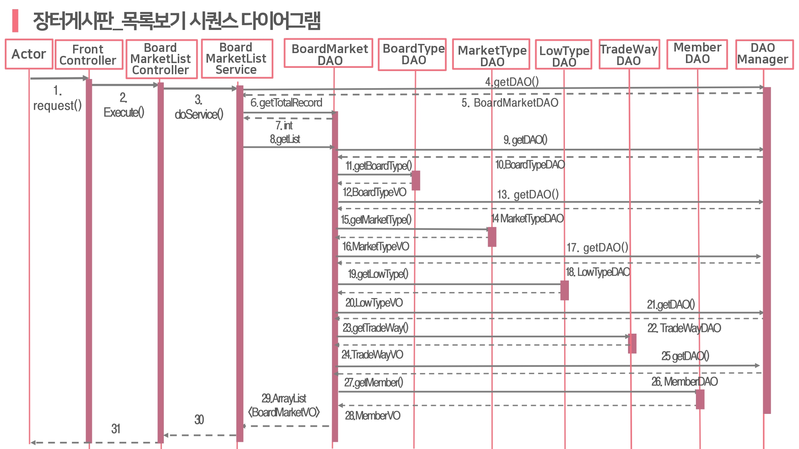

### 4. 홍보게시판
#### 📍홍보 게시판 글 작성
제목/글분류/시작일/종료일/첨부파일/내용을 작성한 뒤 '글 등록' 버튼을 통해 등록 
🔎태그를 함께 달아서 글 게시 가능
#### 📍홍보 게시판 글 수정
본인에 한하여 글 제목, 글분류, 시작일, 종료일, 내용 수정 가능
#### 📍홍보 게시판 글 삭제
본인/관리자에 한하여 글 삭제 가능
#### 📍홍보 게시판 목록보기
전체보기/모임/축제/스터디/종료된 행사 중 하나의 카테고리 선택 후 카드 형태로 확인 가능
🔎글제목/작성자/작성일자 순으로 확인가능
#### 📍홍보 게시판 글 보기
조회수/좋아요/제목/마감일자/내용/작성자닉네임/학교/작성일자 순으로 표시됨.
#### 📍홍보 게시판 태그 검색
게시물에 단 태그는 상단 태그바에 고정되며, 해당 태그를 클릭하면 관련 게시물이 검색됨.

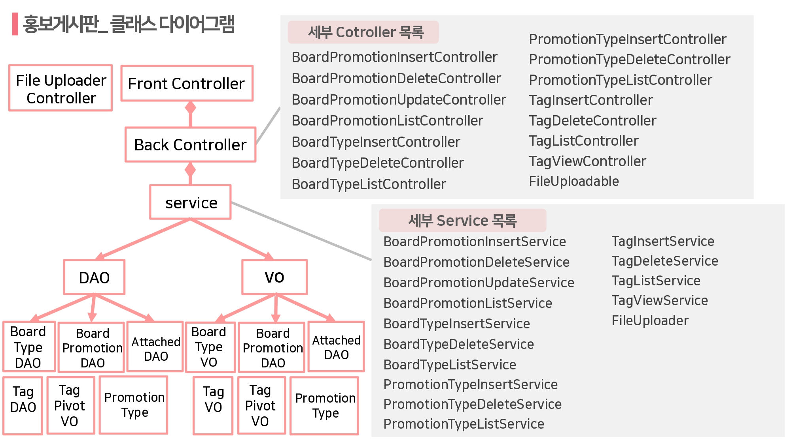

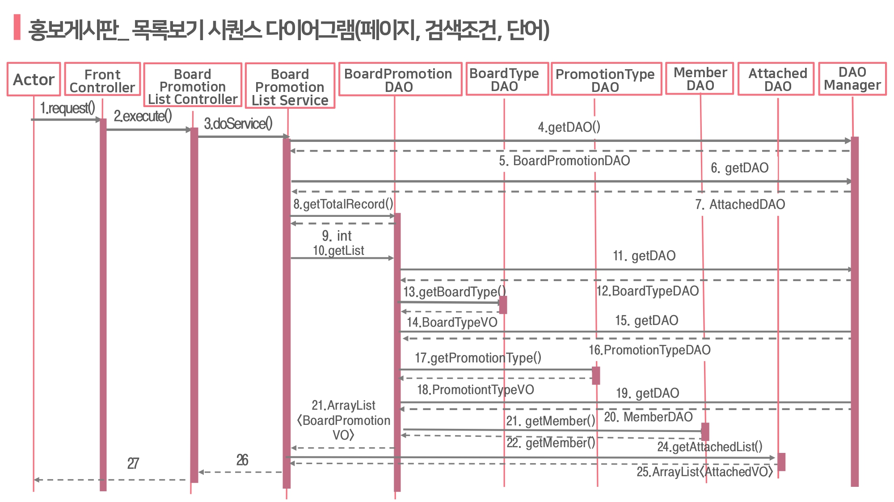

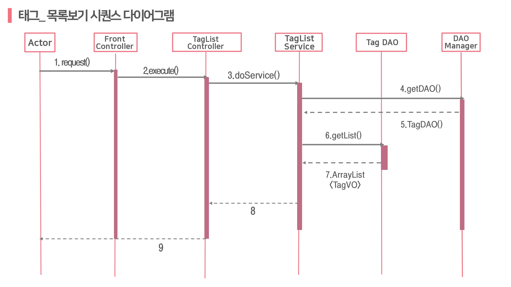

### 5. 댓글&좋아요
#### 📍댓글 작성
자유게시판, 장터게시판, 홍보게시판에 댓글 작성 후 등록버튼을 통해 등록
#### 📍댓글 수정
자신이 쓴 댓글에 한하여 삭제가 가능 관리자 또한 삭제가능
#### 📍댓글 삭제
자신이 쓴 댓글에 한하여 내용만 수정이 가능.
관리자 또한 수정가능
#### 📍댓글 보기
각 댓글은 작성자의 닉네임, 내용, 작성날짜, 좋아용 수 순으로 표시됨.

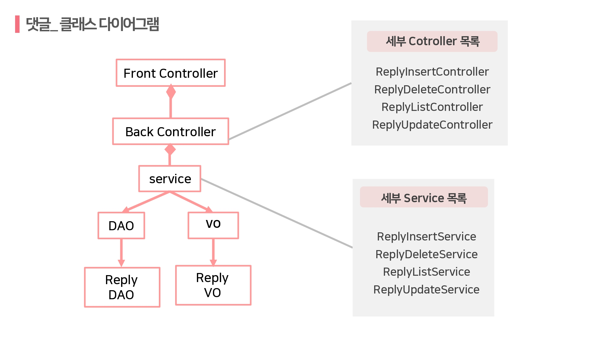

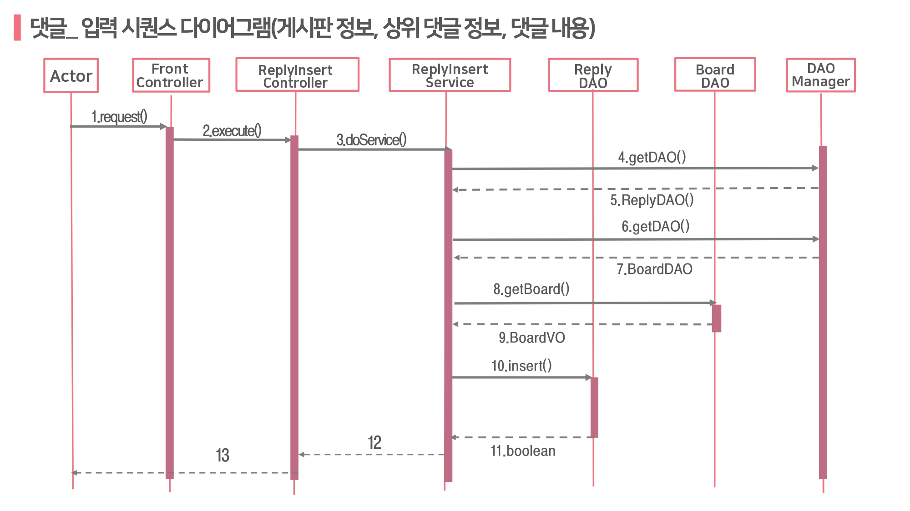

#### 📍좋아요 누르기
특정 게시글/댓글에 좋아요를 누를 수 있음
🔎누른 글에는 *로 표시
#### 📍좋아요 취소하기
이미 좋아요를 누른 게시글/댓글에 다시 좋아요를 누르면 취소됨
#### 📍좋아요 누적
좋아용 누적 횟수가 버튼 우측에 표시됨

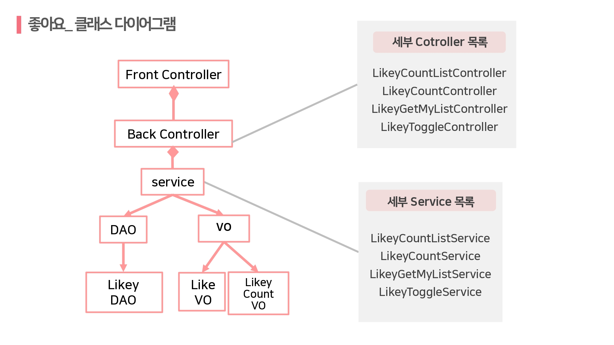

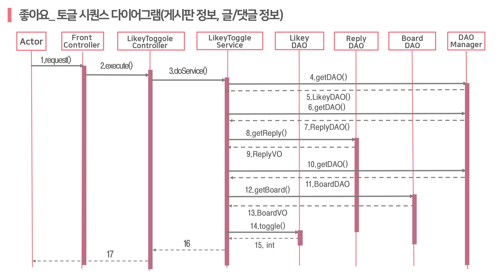

